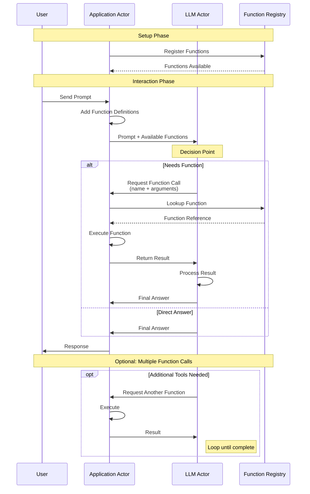

# LLM Function Calling Architecture

This diagram shows the interaction flow between actors in the LLM function calling pattern.

## Key Components

- **User**: Initiates requests with prompts
- **Application Actor**: Manages function registry and execution
- **LLM Actor**: Decides whether to call functions or respond directly
- **Function Registry**: Stores available functions and their implementations

## Flow Description

1. **Setup Phase**: Application registers available functions
2. **Request Phase**: User sends prompt, app adds function definitions
3. **Decision Phase**: LLM analyzes request and available functions
4. **Execution Phase**: If needed, LLM requests function execution
5. **Response Phase**: Final answer is sent back to user
6. **Loop**: Multiple function calls possible in single interaction