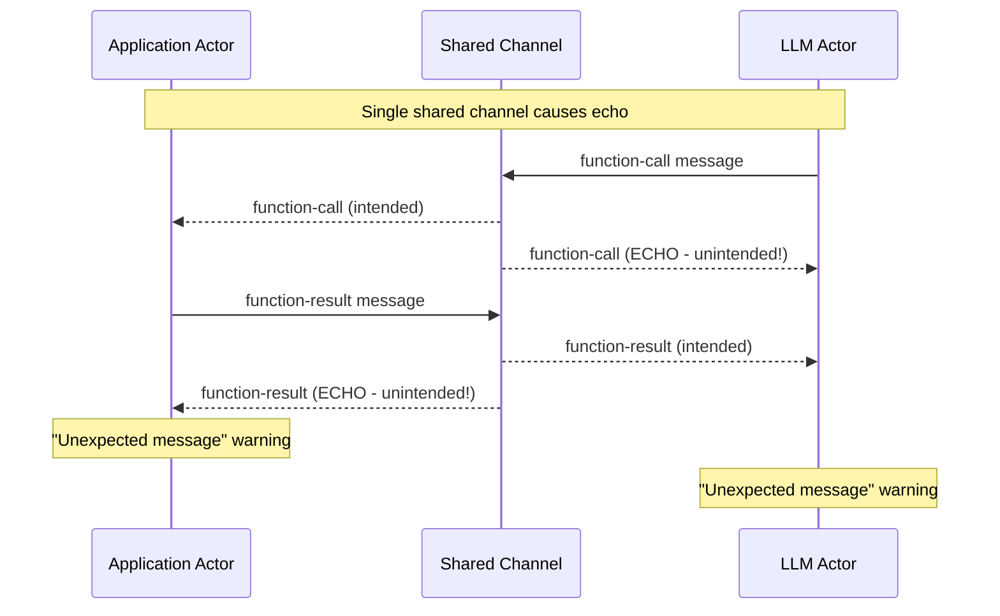
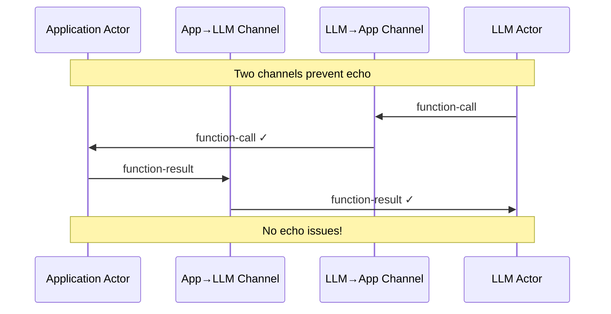

# Channel Echo Issue

## Problem

Our current implementation uses a single shared channel, causing messages to echo back to the sender.

## Current Behavior

## Root Cause

Both actors read from the same channel queue, so they see their own messages as well as messages from the other actor.

## Solution Options

### Option 1: Two Unidirectional Channels (Proper Fix)

### Option 2: Message Filtering (Quick Fix)

Filter messages by sender to ignore our own messages.

## Implementation

We need to create two separate channels for proper actor communication.