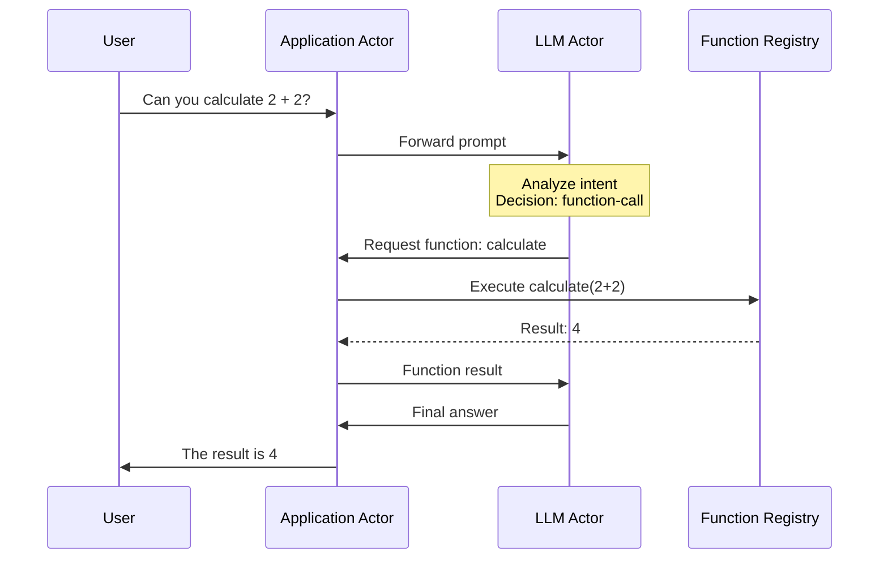
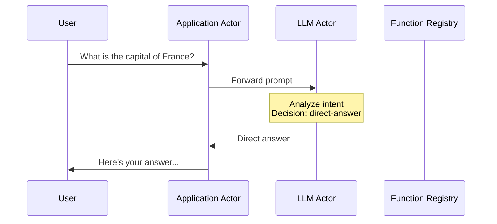
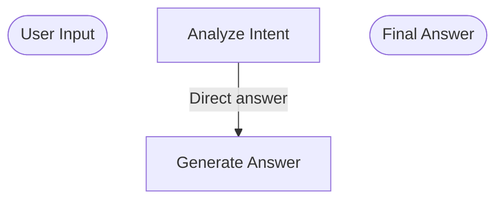

# LLM Actor Flow Visualization
Generated on: 2025-07-23 04:51:11

## Scenario: Function Call Flow
Prompt: "Can you calculate 2 + 2?"

### Sequence Diagram


### Flow Chart
```mermaid
graph TD
    Start([User Input])
    A3[Analyze Intent]
    A3 -->|Function needed| F3[Function Call]
    F5[Execute: calculate(2+2)]
    R6[Result: 4]
    End([Final Answer])
```


## Scenario: Direct Answer Flow
Prompt: "What is the capital of France?"

### Sequence Diagram


### Flow Chart



---
These diagrams show the actual control flow as specified in the sequence diagram.
