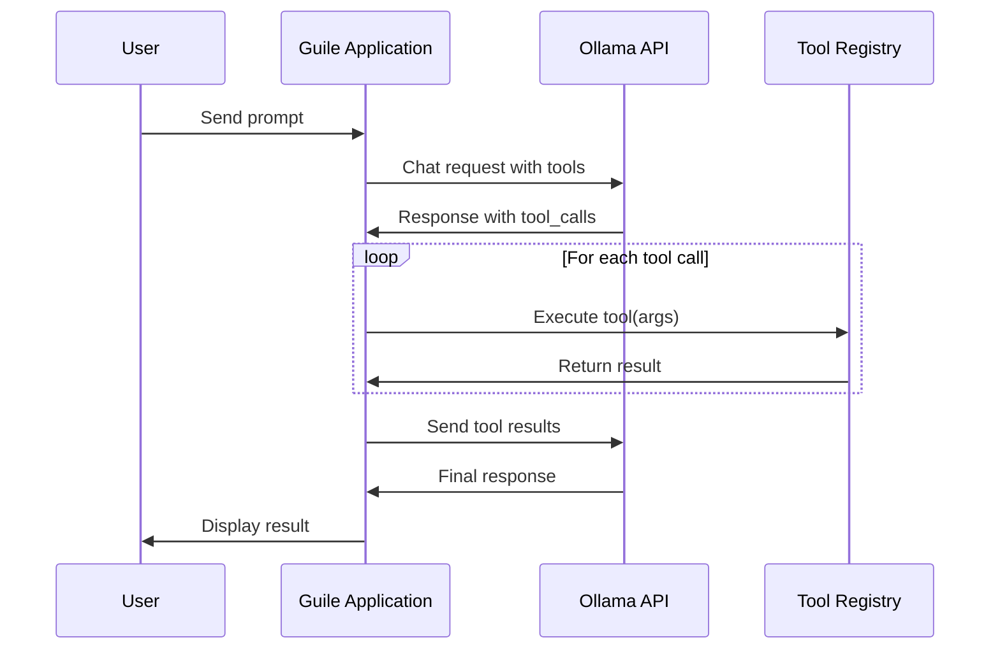

# Tool Calling Sequence Diagram

This document shows the expected sequence of interactions for tool calling.

## Expected Flow

1. **User Input**: User provides a prompt requiring tool usage
2. **Initial Request**: Application sends prompt to Ollama with available tools
3. **Tool Decision**: Ollama analyzes and returns tool_calls if needed
4. **Tool Execution**: Application executes requested tools locally
5. **Result Submission**: Tool results sent back to Ollama
6. **Final Response**: Ollama incorporates results into final answer
7. **User Output**: Application displays the complete response

## Key Validation Points

- Tool registration format matches Ollama expectations
- Tool calls are properly parsed and executed
- Results are correctly formatted for Ollama
- Error handling maintains conversation flow
- Performance through SSH tunnel is acceptable
